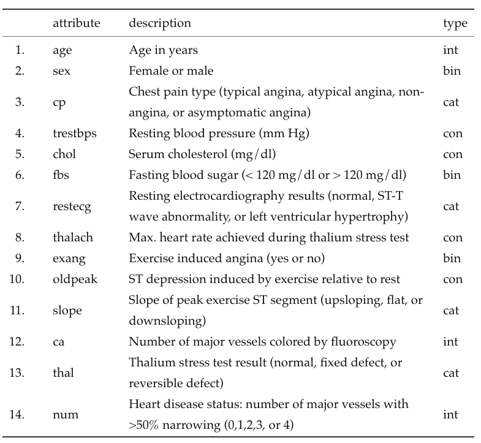
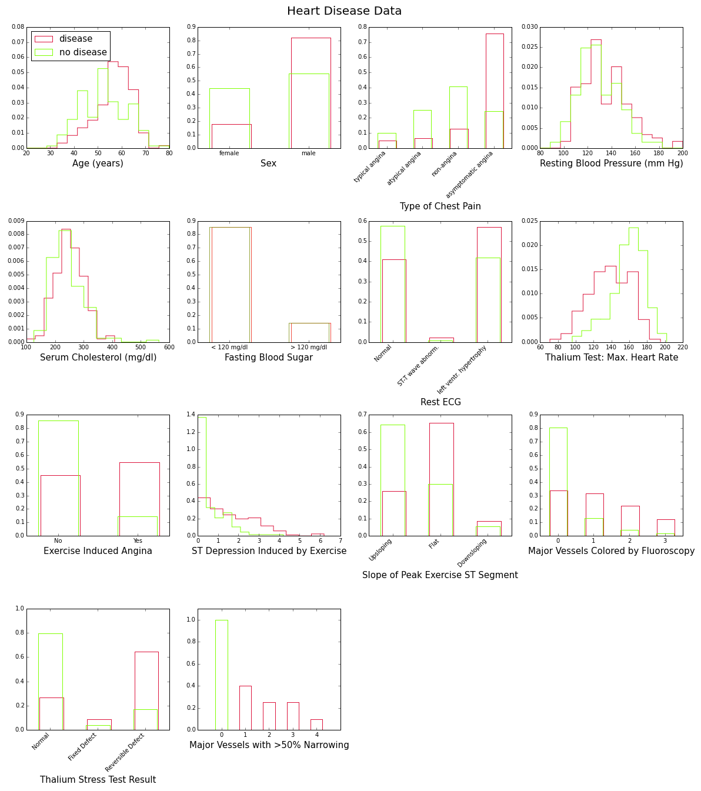
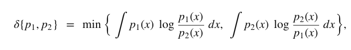
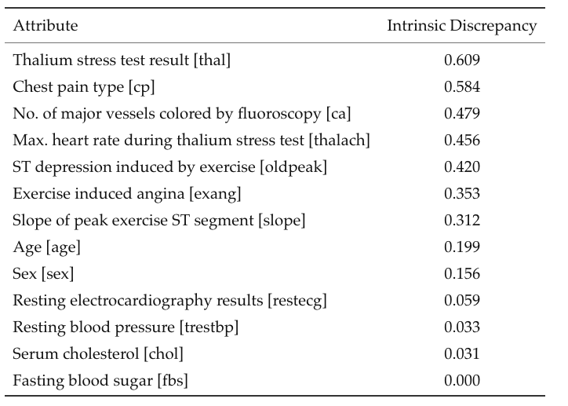
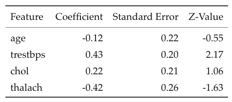
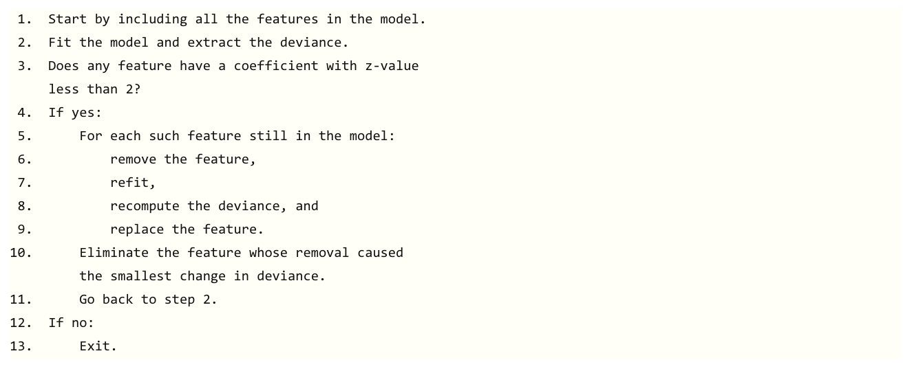
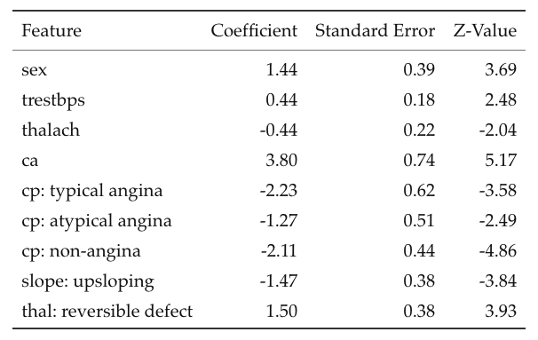
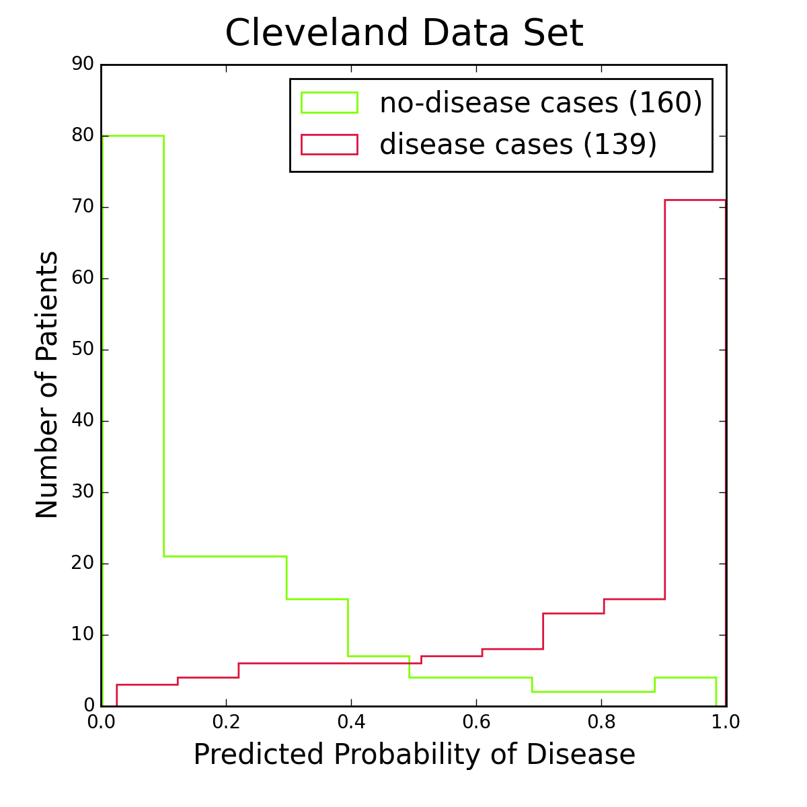

# HeartDiseaseStudy
-----------

## Introduction

My third project involved estimating the probability of heart disease for patients admitted to a hospital emergency room with symptoms of chest pain.

## The Heart Disease Data

I used the heart disease data set available from the UC Irvine Machine Learning Repository. This data set dates from 1988 and consists of four databases: Cleveland (303 instances), Hungary (294), Switzerland (123), and Long Beach VA (200). Each database provides 76 attributes, including the predicted attribute. There are many missing attribute values. In addition, the Cleveland data set became corrupted after the loss of a computing node, and the surviving data set contains only 14 attributes per instance. Counting only instances with non-missing values for these 14 attributes, the total for all four databases is 299 instances (297 from Cleveland alone). This is the data set I will be using, and for simplicity I will be referring to it as the Cleveland data set.

The 14 attributes are described in the table below; the last row (“num”) is the attribute to be predicted.

*Table 1: Attributes of the heart disease patients in the Cleveland data set; the last row (heart disease status) is the response variable; the type column indicates whether an attribute is binary (bin), integer (int), categorical (cat), or continuous (con).*

To gain some insight into the power of these attributes to discriminate between disease (num>0) and no disease (num=0), let’s look at their distributions over the corresponding subsamples (139 patients with disease, 160 without). This is shown in Figure 1 below:

*Figure 1: Histograms and bar charts of the 14 attributes in the heart disease data set, for patients with (red) and without (green) the disease. All distributions are normalized to unit area in order to emphasize differences in shape.*

These plots show with various degrees of “obviousness” that people with heart disease tend to be older and male, and have higher blood pressure, higher cholesterol levels, lower maximum heart rate under the Thalium stress test, etc., than people without the disease. One way to quantify this degree of obviousness is to measure the discrepancy between the “disease” and “no-disease” distributions for each attribute. This can be done with the so-called intrinsic discrepancy between two probability distributions ​p1 and ​p2, which is based on information theory and is defined by:

provided one of the integrals is finite. For discrete distributions such as those in Figure 1, the integrals become sums. After sorting them in decreasing order, the intrinsic discrepancies between disease and no-disease for the first 13 attributes in Table 1 are as follows:

*Table 2: Intrinsic discrepancies between the disease and no-disease distributions of the attributes in the Cleveland data set.*

These results give us some idea about which features would be valuable for inclusion in a machine learning model, but it should be remembered that they do not take correlations into account. Thus they are more useful as a benchmark, or to answer the question of which test one should choose if one had the resources to perform only one.

## The Logistic Model: Feature Selection and Fit

Since the Cleveland data set has limited statistics, I won’t try to predict all the categories of the heart disease status feature, but only whether or not heart disease is present (num>0 or num=0). I’ll be using logistic regression, which has the advantage of providing a probability estimate for the prediction.

What is the optimal set of attributes that should be used? And how should we define optimality?

If we fit the simplest logistic model (log-odds linear in both the parameters and the features) to the Cleveland data, we would expect, based on Figure 1, that the coefficients of the age, blood pressure, and serum cholesterol features will be positive, whereas the coefficient of the maximum heart rate feature [thalach] will be negative. Here is what we actually find:

*Table 3: Fit to the Cleveland data of a logistic model with the first thirteen attributes of Table 1. Results for only four out of the thirteen features are shown. For each feature listed in the first column, the table shows the values of the fitted coefficient and standard error (columns 2 and 3), as well as their ratio (the z-value in column 4).*

The great surprise is that the coefficient of the age feature is negative, as if older people had a lower risk of heart disease! This is not the whole story however. The standard error on the age coefficient is quite large; it certainly allows for the true value of that coefficient to be zero or even positive: ​`−0.12±0.22` means that, with 68% confidence, the true age coefficient is between -0.34 and 0.10. This is also indicated by the z-value of -0.55, which is too small to provide convincing evidence that we actually need the age feature to account for the heart disease status of patients in the Cleveland data set.

The technical reason for this glitch is two-fold: the features in the Cleveland data set are correlated, and the sample size is too small to determine all the feature coefficients with sufficient precision. This means that we need to be extra careful in selecting features for the final model. One approach is to loop over all combinations of features and select the one that yields the highest accuracy (defined as the fraction of times the logistic regression classifier correctly predicts the heart disease status of a patient). Unfortunately this approach does not take precision into account: It simply assumes that we have a large enough sample to determine precisely the coefficient of any selected feature. Sure enough, when I tried this approach, the age feature was included with a negative coefficient!

A better approach for this problem is to start with all features included, and then eliminate one by one features whose fitted coefficient is not significantly different from zero. The order of elimination should be such that the model deviance remains the lowest possible (defined as minus twice the log-likelihood of the model, the deviance is the function minimized by the fitter to obtain the feature coefficients). Here is what the pseudo-code for this approach looks like:

The output of this algorithm is the largest subset of features whose fit coefficients are at least two standard deviations away from zero, and such that the total change in fit deviance is the smallest possible. When applied to the logistic regression model for the Cleveland data, nine features are selected, five of which are binary variables coming from three of the original categorical attributes. This is the fit result:

*Table 4: Final results of a fit to the Cleveland data of a logistic regression model with the optimal subset of features. The bottom five features are binary variables resulting from three of the original categorical attributes in Table 1. For example, “cp: typical angina” is 1 when the chest pain type is typical angina and 0 otherwise.*

Age is not part of the optimal set of features, and the coefficients of all selected features have a z-value of at least 2 (in absolute value). Note also that the top four attributes by order of intrinsic discrepancy (thal, cp, ca, and thalach, see Table 2) are part of this final selection.

## Model Accuracy

*Figure 2: Histograms of logistic regression probabilities for the entire Cleveland data set. The red histogram is for patients with heart disease, the green one for patients without the disease.* 

Figure 2 shows histograms of logistic regression probabilities for the Cleveland data set, the data I used for training the model. To classify a patient as having the disease, I require the logistic probability to be at least 50%. This is a standard choice, and from the figure it seems reasonable. Other choices are of course possible, especially if one is more concerned about one type of classification error than another.

I used the full Cleveland data set to fit the logistic regression model, leaving out no data for an independent test of the model. Even the reduced set of features in the final optimization does not allow to extend the data set with the other databases (Hungary, Long Beach, or Switzerland), because one or more of the “slope”, “ca”, and “thal” attributes are consistently missing values in those.

To obtain unbiased estimates of the accuracy, precision, and recall properties of the logistic model I used a three-way cross-validation procedure. I divided the Cleveland dataset randomly into three almost equal parts. For each part, I trained the model on the other two parts combined and measured its properties on the part not used for training. This gave three unbiased estimates of the desired model properties, which were then averaged. Note that the training included both the feature selection and the model fit. For the accuracy (fraction of disease or no-disease predictions that are correct) I found ​(79.6±1.4)%(79.6±1.4)%. For the precision I found ​(82.7±6.6)%(82.7±6.6)% (fraction of disease predictions that are correct) and ​(78.6±2.7)%(78.6±2.7)% (fraction of no-disease predictions that are correct). Finally, for the recall the numbers are ​(73.0±4.1)%(73.0±4.1)% (fraction of disease cases that are correctly identified) and ​(86.0±6.2)%(86.0±6.2)% (fraction of no-disease cases that are correctly identified).

## Summary

The coefficients listed in Table 4 can be used to construct a simple equation for predicting heart disease (for maximum accuracy I used the full Cleveland data set to determine these coefficients). You can plug in correspoding attribute values and see the risk of heart disease as a percentage.

## Technical Note

iPython notebooks and other files used to generate the results and plots for the McNulty project:

1. **convert\_ssv\_to\_csv.py**: Converts a file with space-separated values into a file with comma-separated values.

1. **join\_files.py**: Joins files downloaded from the UC Irvine Machine Learning Repository into a single file for processing by the iPython notebook below.

1. **KNearestNeighbors.py**: Short program to select features by maximizing the accuracy of K-nearest neighbors classifier.

1. **HeartDiseaseProject.ipynb**: iPython notebook to read in the data, store them in a Pandas dataframe for initial processing and plots, and analyze with a logistic regression model.  Cells at the end of the notebook investigate naive Bayes, support vector machine, decision tree, and random forest classifiers to select features that maximize accuracy.  These methods were not pursued further however.

The initial processing steps of this study are as follows:

`curl -o data/cleveland14.csv https://archive.ics.uci.edu/ml/machine-learning-databases/heart-disease/processed.cleveland.data`

`curl -o data/hungarian14r.ssv https://archive.ics.uci.edu/ml/machine-learning-databases/heart-disease/reprocessed.hungarian.data`

`curl -o data/switzerland14.csv https://archive.ics.uci.edu/ml/machine-learning-databases/heart-disease/processed.switzerland.data`

`curl -o data/long_beach_va14.csv https://archive.ics.uci.edu/ml/machine-learning-databases/heart-disease/processed.va.data`

`python convert_ssv_to_csv.py hungarian14r`

`python join_files.py`

The output of join\_files.py is file data/heart\_disease\_all14.csv and is ready for processing by HeartDiseaseProject.ipynb.
